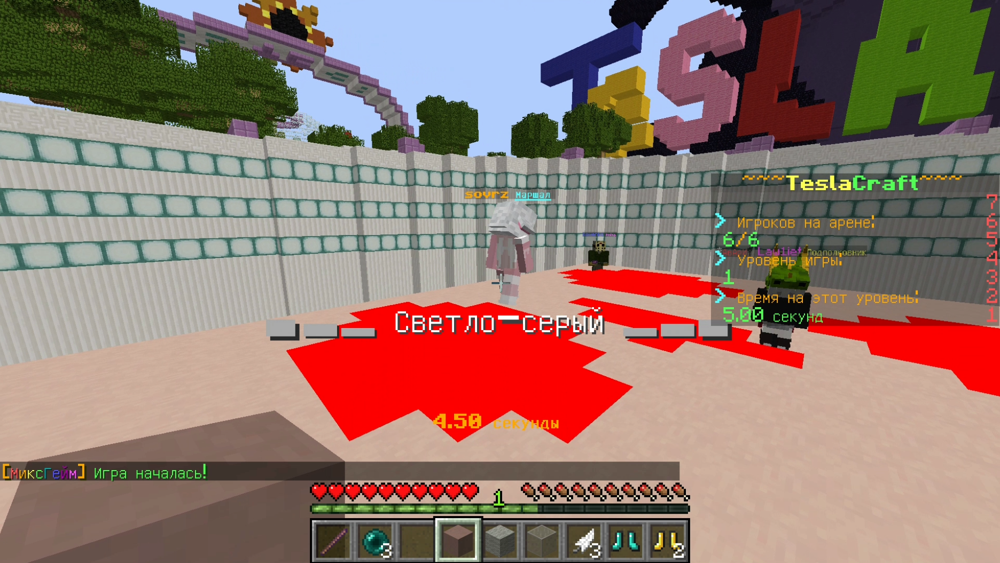

## Introduction
Block party ESP is a mod for legacy Minecraft Forge 1.12.2 that highlights correct blocks in the block party mini-game. It can make the game a lot easier for you.

## Getting started
Block party ESP requires Minecraft Forge 1.12.2. Download the jar file from the latest release (or build it manually from source) and copy it to you mods directory. Check if the mod is loaded through the Forge mods menu.

Use `/blockpartyesp enable` to enable blocks highlighting and `/blockpartyesp disable` to disable respectively.

If you want to use mods like [MacroKey](https://github.com/Matts/MacroKey) for toggle highlighting, use `/blockpartyesp toggle`

Shortened alias `/bpesp` can also be used.

## Configuration
Block party ESP configured using the Forge mods settings menu.

You must specify the slot in hotbar starting from which the correct blocks are located and their count. It is also possible to select the block highlighting color, and highlightable area size.

## License
Block party ESP is provided under MIT license. Feel free to explore, make changes and share with friends!

## Contributing
find me gf pls..